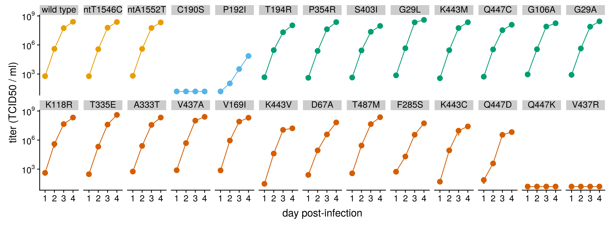
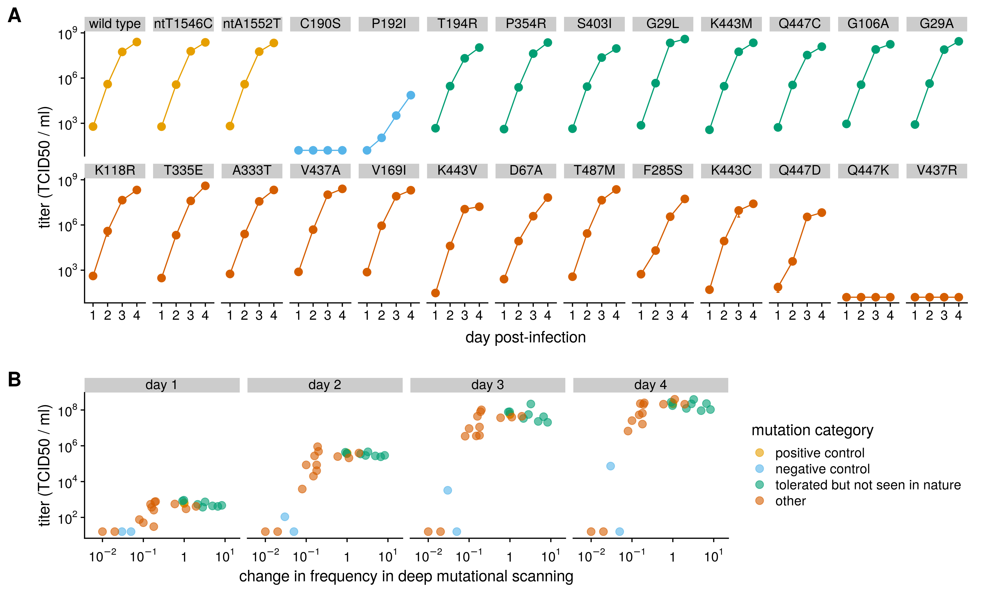

# Plot growth data
This R Jupyter notebook uses ggplot2 to plot the growth curve data.

Load R packages:


```R
options(warn=-1)

library("tidyverse")
library("cowplot")
library("IRdisplay")

sessionInfo()
```

    ── Attaching packages ─────────────────────────────────────── tidyverse 1.2.1 ──
    ✔ ggplot2 3.2.0     ✔ purrr   0.2.5
    ✔ tibble  1.4.2     ✔ dplyr   0.7.8
    ✔ tidyr   0.8.1     ✔ stringr 1.3.1
    ✔ readr   1.1.1     ✔ forcats 0.3.0
    ── Conflicts ────────────────────────────────────────── tidyverse_conflicts() ──
    ✖ dplyr::filter() masks stats::filter()
    ✖ dplyr::lag()    masks stats::lag()
    
    Attaching package: ‘cowplot’
    
    The following object is masked from ‘package:ggplot2’:
    
        ggsave
    


    R version 3.5.1 (2018-07-02)
    Platform: x86_64-conda_cos6-linux-gnu (64-bit)
    Running under: Ubuntu 14.04.5 LTS
    
    Matrix products: default
    BLAS/LAPACK: /fh/fast/bloom_j/software/conda/envs/BloomLab_v2/lib/R/lib/libRblas.so
    
    locale:
     [1] LC_CTYPE=en_US.UTF-8       LC_NUMERIC=C              
     [3] LC_TIME=en_US.UTF-8        LC_COLLATE=en_US.UTF-8    
     [5] LC_MONETARY=en_US.UTF-8    LC_MESSAGES=en_US.UTF-8   
     [7] LC_PAPER=en_US.UTF-8       LC_NAME=C                 
     [9] LC_ADDRESS=C               LC_TELEPHONE=C            
    [11] LC_MEASUREMENT=en_US.UTF-8 LC_IDENTIFICATION=C       
    
    attached base packages:
    [1] stats     graphics  grDevices utils     datasets  methods   base     
    
    other attached packages:
     [1] IRdisplay_0.7.0 cowplot_0.9.3   forcats_0.3.0   stringr_1.3.1  
     [5] dplyr_0.7.8     purrr_0.2.5     readr_1.1.1     tidyr_0.8.1    
     [9] tibble_1.4.2    ggplot2_3.2.0   tidyverse_1.2.1
    
    loaded via a namespace (and not attached):
     [1] pbdZMQ_0.3-3     tidyselect_0.2.4 repr_0.19.1.9000 haven_1.1.2     
     [5] lattice_0.20-35  colorspace_1.3-2 htmltools_0.3.6  base64enc_0.1-3 
     [9] rlang_0.3.0.1    pillar_1.3.0     glue_1.3.0       withr_2.1.2     
    [13] modelr_0.1.2     readxl_1.1.0     bindrcpp_0.2.2   uuid_0.1-2      
    [17] bindr_0.1.1      munsell_0.5.0    gtable_0.2.0     cellranger_1.1.0
    [21] rvest_0.3.2      evaluate_0.11    broom_0.5.0      Rcpp_1.0.0      
    [25] backports_1.1.2  scales_1.0.0     IRkernel_0.8.12  jsonlite_1.6    
    [29] hms_0.4.2        digest_0.6.18    stringi_1.2.4    grid_3.5.1      
    [33] cli_1.0.0        tools_3.5.1      magrittr_1.5     lazyeval_0.2.1  
    [37] crayon_1.3.4     pkgconfig_2.0.1  xml2_1.2.0       lubridate_1.7.4 
    [41] assertthat_0.2.0 httr_1.3.1       rstudioapi_0.7   R6_2.2.2        
    [45] nlme_3.1-137     compiler_3.5.1  


Color-blind palette:


```R
cbPalette <- c("#999999", "#E69F00", "#56B4E9", "#009E73",
               "#D55E00", "#CC79A7")
```

Plot axes labels in nice scientific notation:


```R
fancy_scientific <- function(x, parse.str=TRUE, digits=NULL) {
  # scientific notation formatting, based loosely on https://stackoverflow.com/a/24241954
  # if `parse.str` is TRUE, then we parse the string into an expression
  # `digits` indicates how many digits to include
  x %>% format(scientific=TRUE, digits=digits) %>% gsub("^0e\\+00","0", .) %>%
    gsub("^1e\\+00", "1", .) %>% gsub("^(.*)e", "'\\1'e", .) %>% 
    gsub("e\\+","e", .) %>% gsub("e", "%*%10^", .) %>%
    gsub("^\'1\'\\%\\*\\%", "", .) %>% {if (parse.str) parse(text=.) else .}
}
```

Function to save and show plots:


```R
figsdir <- "results/growth_data"
dir.create(figsdir, showWarnings=FALSE)

saveShowPlot <- function(p, width, height, plotname=NA) {
  if (is.na(plotname))
    plotname <- gsub("\\.", "_", deparse(substitute(p))) 
  pngfile <- file.path(figsdir, sprintf("%s.png", plotname))
  pdffile <- file.path(figsdir, sprintf("%s.pdf", plotname))
  ggsave(pngfile, plot=p, width=width, height=height, units="in")
  ggsave(pdffile, plot=p, width=width, height=height, units="in")
  display_png(file=pngfile, width=90 * width)
}
```

Read in the growth curve data:


```R
data <- read.csv('data/all_growth_data.csv') %>%
  transform(category=factor(category, c("positive control", "negative control",
                                        "unexpectedly favorable", "unexpectedly unfavorable",
                                        "unfavorable", "antibody selected"))) %>%
  arrange(category, desc(DMS_foldchange), desc(mutation))
```

Tidy the data for plotting.
We are only going to plot the growth curve data and ignore the transfection titers:


```R
tidy_data <- data %>%
  gather(day, titer, day_1, day_2, day_3, day_4) %>%
  gather(day_sd, titer_SD, day_1_SD, day_2_SD, day_3_SD, day_4_SD) %>%
  mutate(day=day %>% str_replace('_', ' '),
         day_sd=day_sd %>% str_replace('_SD', '') %>% str_replace('_', ' ')) %>%
  filter(day == day_sd) %>%
  select(mutation, category, DMS_foldchange, day, titer, titer_SD) %>%
  mutate(day_num=day %>% str_replace('day ', '') %>% as.integer)

tidy_data %>% head
```


<table>
<thead><tr><th scope=col>mutation</th><th scope=col>category</th><th scope=col>DMS_foldchange</th><th scope=col>day</th><th scope=col>titer</th><th scope=col>titer_SD</th><th scope=col>day_num</th></tr></thead>
<tbody>
	<tr><td>wild type             </td><td>positive control      </td><td>1.00                  </td><td>day 1                 </td><td>605.375               </td><td> 88.82787             </td><td>1                     </td></tr>
	<tr><td>ntT1546C              </td><td>positive control      </td><td>1.00                  </td><td>day 1                 </td><td>598.250               </td><td>164.56220             </td><td>1                     </td></tr>
	<tr><td>ntA1552T              </td><td>positive control      </td><td>1.00                  </td><td>day 1                 </td><td>655.250               </td><td>102.41210             </td><td>1                     </td></tr>
	<tr><td>C190S                 </td><td>negative control      </td><td>0.05                  </td><td>day 1                 </td><td> 16.000               </td><td>  0.00000             </td><td>1                     </td></tr>
	<tr><td>P192I                 </td><td>negative control      </td><td>0.03                  </td><td>day 1                 </td><td> 16.000               </td><td>  0.00000             </td><td>1                     </td></tr>
	<tr><td>T194R                 </td><td>unexpectedly favorable</td><td>8.32                  </td><td>day 1                 </td><td>469.500               </td><td> 70.58860             </td><td>1                     </td></tr>
</tbody>
</table>


Plot correlations among DMS fold-change and titers:


```R
dms_titer_corr <- tidy_data %>%
  ggplot(aes(DMS_foldchange, titer, color=category)) +
  geom_point(size=3, alpha=0.7) +
  facet_wrap(~ day, nrow=1) +
  scale_x_log10(name="change in frequency in deep mutational scanning",
                labels=fancy_scientific,
                expand=expand_scale(0.15, 0)) +
  scale_y_log10(name="titer (TCID50 / ml)",
                labels=fancy_scientific) +
  scale_color_manual(values=cbPalette,
                     name='mutation category') +
  theme(axis.text.x=element_text(vjust=0))

saveShowPlot(dms_titer_corr, 11.5, 2.75)
```


Plot titers for individual samples:


```R
dms_titer_vals <- tidy_data %>%
  transform(mutation=factor(mutation, tidy_data$mutation %>% unique)) %>%
  ggplot(aes(day_num, titer, color=category)) +
  geom_point(size=3) +
  geom_line() +
  geom_errorbar(aes(ymin=titer - titer_SD, ymax=titer + titer_SD), width=0.2) +
  facet_wrap(~ mutation, ncol=13) +
  scale_y_log10(name="titer (TCID50 / ml)",
                labels=fancy_scientific) +
  scale_x_continuous(name='day post-infection',
                     expand=expand_scale(0.15, 0)) +
  scale_color_manual(values=cbPalette, guide=FALSE)

saveShowPlot(dms_titer_vals, 11.5, 4.25)
```





With black error bars:


```R
dms_titer_vals_black_error <- dms_titer_vals + 
  geom_errorbar(aes(ymin=titer - titer_SD, ymax=titer + titer_SD), width=0.2, color='black')

saveShowPlot(dms_titer_vals_black_error, 11.5, 4.25)
```


Use cowplot to arrange into a single figure:


```R
merged_plot <- plot_grid(
    dms_titer_vals, dms_titer_corr,
    labels=c("A", "B"), label_size=18,
    ncol=1, rel_heights=c(4.25, 2.75), scale=0.95)

saveShowPlot(merged_plot, 12.5, 7.5)
```





Same figure with black error bars:


```R
merged_plot_black_error <- plot_grid(
    dms_titer_vals_black_error, dms_titer_corr,
    labels=c("A", "B"), label_size=18,
    ncol=1, rel_heights=c(4.25, 2.75), scale=0.95)

saveShowPlot(merged_plot_black_error, 12.5, 7.5)
```


